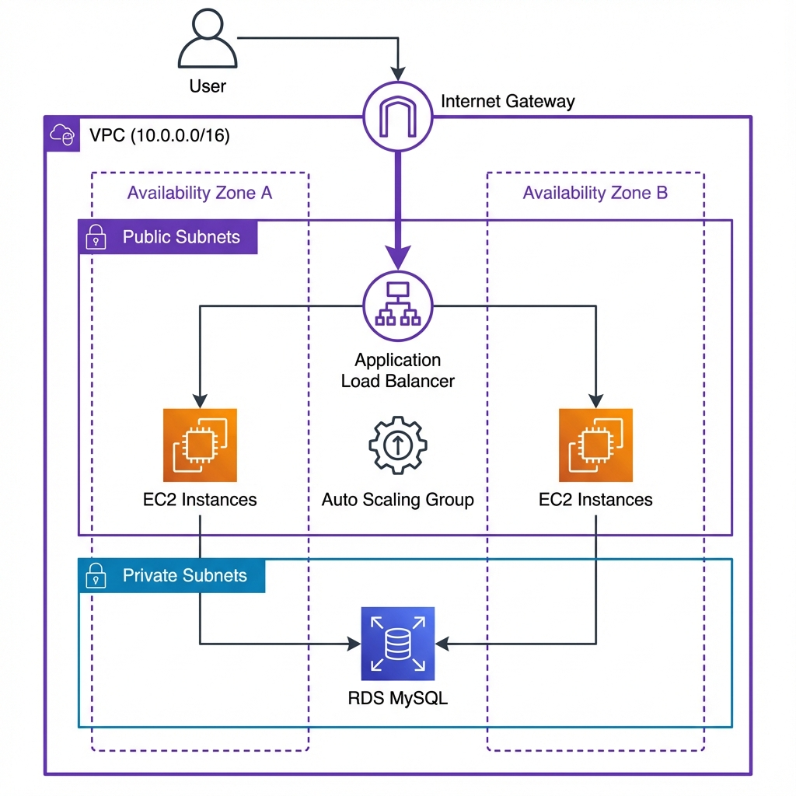

# Keeps Light

A full-stack note-taking application deployed on AWS using Terraform for infrastructure provisioning.

## Overview

This is a Google Keep-inspired web application with a Node.js backend and MySQL database. The infrastructure is deployed on AWS using Terraform, featuring auto-scaling EC2 instances, an Application Load Balancer, and RDS for database management.

## Architecture

The application runs on AWS with the following components:



- **Application Load Balancer** - Distributes traffic across EC2 instances
- **EC2 Auto Scaling Group** - Hosts the Node.js application
- **RDS MySQL** - Managed database for persistent storage
- **VPC** - Network isolation with public and private subnets
- **Security Groups** - Controls traffic between components

## Tech Stack

**Backend**
- Node.js 18
- Express.js
- MySQL 8.0 (RDS)

**Frontend**
- HTML/CSS/JavaScript
- Responsive design with glassmorphism UI

**Infrastructure**
- Terraform for IaC
- AWS (VPC, EC2, RDS, ALB, Auto Scaling)
- PM2 for process management

## Project Structure

```
├── public/              # Frontend files
│   ├── index.html
│   ├── style.css
│   └── app.js
├── terraform/           # Infrastructure as Code
│   ├── vpc.tf
│   ├── compute.tf
│   ├── database.tf
│   ├── alb.tf
│   ├── security.tf
│   ├── variables.tf
│   ├── outputs.tf
│   └── user_data.sh
├── server.js            # Express server
├── db.js                # Database connection
├── schema.sql           # Database schema
└── package.json
```

## Deployment

### Prerequisites

- AWS account with configured credentials
- Terraform installed
- AWS CLI configured
- SSH key pair in AWS

### Steps

1. Clone the repository
```bash
git clone https://github.com/tasbirul/Keeps-Light.git
cd Keeps-Light
```

2. Configure Terraform variables
```bash
cd terraform
cp terraform.tfvars.example terraform.tfvars
# Edit terraform.tfvars with your AWS settings
```

3. Deploy infrastructure
```bash
terraform init
terraform plan
terraform apply
```

4. Access the application
```bash
terraform output alb_dns_name
```

The deployment takes approximately 6-8 minutes for initial setup.

## Infrastructure Details

### Networking
- VPC with public and private subnets across 2 availability zones
- Internet Gateway for public internet access
- Route tables configured for subnet traffic

### Compute
- Auto Scaling Group with configurable min/max instances
- Launch template with automated deployment via user_data
- PM2 for application process management

### Database
- RDS MySQL 8.0 in private subnet
- Automated backups enabled
- Connection pooling for performance

### Security
- Security groups restrict traffic:
  - ALB: Port 80 (HTTP)
  - EC2: Port 3000 from ALB, Port 22 from specific IP
  - RDS: Port 3306 from EC2 only
- Database not publicly accessible

## Local Development

```bash
npm install
npm start
```

Application runs on `http://localhost:3000`

## Features

- Create, edit, and delete notes
- Pin important notes
- Color-code notes (12 colors)
- Persistent storage in MySQL
- Responsive design

## Configuration

Key Terraform variables in `terraform.tfvars`:

- `aws_region` - AWS region for deployment
- `vpc_cidr` - VPC CIDR block
- `db_username` - Database username
- `db_password` - Database password
- `github_repo` - Repository URL for code deployment
- `my_ip` - IP address for SSH access

## Monitoring

Access EC2 instance logs:
```bash
ssh -i your-key.pem ec2-user@INSTANCE_IP
pm2 logs keeps-light
```

Health checks run every 30 seconds on port 3000.

## Cost Estimate

Approximate monthly cost in us-east-1:
- EC2 t3.micro: ~$7.50
- RDS db.t3.micro: ~$15.00
- ALB: ~$16.00
- Total: ~$40-50/month

