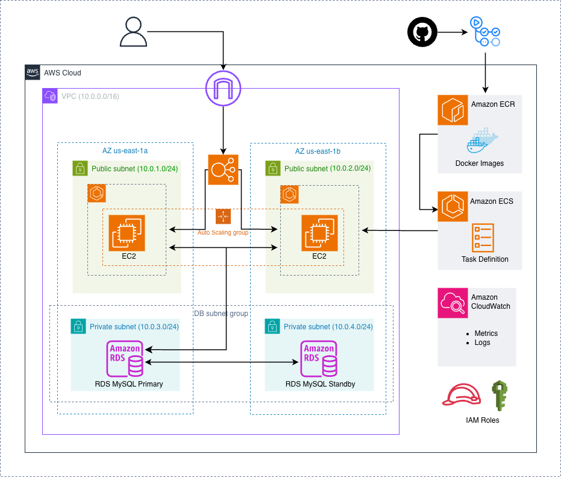

# Keeps Light

**Production-ready AWS infrastructure showcasing containerized deployment with Amazon ECS on EC2, featuring automated CI/CD pipelines and Infrastructure as Code.**

[](https://aws.amazon.com/)
[](https://www.terraform.io/)
[](https://aws.amazon.com/ecs/)
[](https://www.docker.com/)

## Architecture Diagram



## Table of Contents

- [Executive Summary](#-executive-summary)
- [Quick Start Guide](#-quick-start-guide)
- [AWS Architecture Overview](#-aws-architecture-overview)
- [Infrastructure Components](#-infrastructure-components)
- [Network Architecture](#-network-architecture)
- [Security Architecture](#-security-architecture)

## Executive Summary

**Keeps Light** is a production-ready, Google Keep-inspired note-taking application built on AWS cloud infrastructure. This project showcases enterprise-level DevOps practices, containerization strategies, and Infrastructure as Code principles using Terraform.

### Key Highlights

- **Fully Containerized**: Docker-based deployment with multi-stage builds for optimal image size
- **Container Orchestration**: Amazon ECS with EC2 launch type for cost-effective container management
- **Infrastructure as Code**: Terraform-managed infrastructure for reproducible deployments
- **High Availability**: Multi-AZ deployment with Application Load Balancer
- **Security-First**: Private subnet isolation, security group segmentation, and IAM best practices
- **Production-Ready**: Automated health checks, rolling deployments, and zero-downtime updates
- **Cost-Optimized**: ~$0-2/month with AWS Free Tier, ~$39/month without

### Technology Stack

| Layer | Technology |
|-------|------------|
| **Frontend** | HTML5, Vanilla JavaScript, CSS3 (Responsive Glassmorphism UI) |
| **Backend** | Node.js 18 (ES Modules), Express.js 4.x |
| **Database** | Amazon RDS MySQL 8.0 (db.t3.micro) |
| **Container Registry** | Amazon ECR with vulnerability scanning |
| **Orchestration** | Amazon ECS with EC2 capacity providers |
| **Load Balancing** | Application Load Balancer (ALB) |
| **Networking** | Amazon VPC with public/private subnets, Internet Gateway |
| **Monitoring** | CloudWatch Container Insights, CloudWatch Logs |
| **Infrastructure** | Terraform 1.0+ (HashiCorp Configuration Language) |

## Quick Start Guide

### Prerequisites

- **AWS Account** with administrative access
- **AWS CLI** configured (`aws configure`)
- **Terraform** v1.0 or later ([install](https://developer.hashicorp.com/terraform/downloads))
- **Docker** installed ([install](https://docs.docker.com/get-docker/))
- **SSH Key Pair** created in AWS EC2 Console
- **Your Public IP** (`curl ifconfig.me`)

### Step-by-Step Deployment

#### 1. Clone Repository

```bash
git clone https://github.com/tasbirul/Keeps-Light.git
cd Keeps-Light
```

#### 2. Configure Terraform Variables

```bash
cd terraform
cp terraform.tfvars.example terraform.tfvars
```

Edit `terraform.tfvars`:

```hcl
aws_region   = "us-east-1"
project_name = "keeps-light"
db_password  = "YourSecurePassword123!"  # Change this!
my_ip        = "1.2.3.4/32"              # Your actual IP
key_name     = "your-aws-key-pair-name"
```

#### 3. Initialize Terraform

```bash
terraform init

# Expected output:
# Terraform has been successfully initialized!
```

#### 4. Create ECR Repository

```bash
terraform apply -target=aws_ecr_repository.keeps_light

# Review plan and type 'yes' to confirm
```

#### 5. Build and Push Docker Image

```bash
# Get ECR repository URL
export ECR_URL=$(terraform output -raw ecr_repository_url)
echo $ECR_URL

# Login to ECR
aws ecr get-login-password --region us-east-1 | \
  docker login --username AWS --password-stdin $ECR_URL

# Build Docker image
cd ..  # Return to project root
docker build -t keeps-light:latest .

# Tag image
docker tag keeps-light:latest $ECR_URL:latest

# Push to ECR
docker push $ECR_URL:latest
```

#### 6. Deploy Full Infrastructure

```bash
cd terraform
terraform apply

# Review the plan (should show ~30 resources to create)
# Type 'yes' to confirm

# Deployment takes approximately 8-10 minutes
# Primary wait: RDS database creation (5-7 min)
```

#### 7. Access Your Application

```bash
# Get ALB DNS name
terraform output alb_dns_name

# Output example: keeps-light-alb-1234567890.us-east-1.elb.amazonaws.com
```

Open in browser: `http://<ALB_DNS_NAME>`

#### 8. Verify Deployment

```bash
# Check ECS service status
aws ecs describe-services \
  --cluster keeps-light-cluster \
  --services keeps-light-service \
  --query 'services[0].{Status:status,Running:runningCount,Desired:desiredCount}'

# Check target health
aws elbv2 describe-target-health \
  --target-group-arn $(terraform output -raw target_group_arn)
```

## AWS Architecture Overview

### Data Flow

1. **User Request** → ALB (Port 80) → Health Check → Target Group
2. **ALB** → ECS Service → ECS Tasks (via dynamic port mapping)
3. **ECS Tasks** → Application Logic (Express.js)
4. **Application** → RDS MySQL (Private Subnet, Port 3306)
5. **Response** ← Application ← Database
6. **Response** ← ALB ← User

## Infrastructure Components

### 1. **Amazon VPC (Virtual Private Cloud)**

**File**: [`terraform/vpc.tf`](terraform/vpc.tf)

- **CIDR Block**: `10.0.0.0/16` (65,536 IP addresses)
- **DNS Support**: Enabled
- **DNS Hostnames**: Enabled

#### Subnet Architecture

| Subnet Type | CIDR Block | Availability Zone | Purpose |
|-------------|------------|-------------------|---------|
| Public-1 | `10.0.1.0/24` | us-east-1a | ALB, ECS EC2 Instances |
| Public-2 | `10.0.2.0/24` | us-east-1b | ALB, ECS EC2 Instances |
| Private-1 | `10.0.3.0/24` | us-east-1a | RDS MySQL Primary |
| Private-2 | `10.0.4.0/24` | us-east-1b | RDS MySQL Standby (Multi-AZ) |

**Key Features**:

- Internet Gateway for public subnet internet access
- Public route table with `0.0.0.0/0` → IGW routing
- Private subnets isolated from direct internet access
- Multi-AZ deployment for high availability

### 2. **Amazon ECS (Elastic Container Service)**

**Files**:

- [`terraform/ecs_cluster.tf`](terraform/ecs_cluster.tf)
- [`terraform/ecs_task.tf`](terraform/ecs_task.tf)
- [`terraform/ecs_service.tf`](terraform/ecs_service.tf)
- [`terraform/ecs_ec2.tf`](terraform/ecs_ec2.tf)

#### ECS Cluster Configuration

```hcl
Cluster Name: keeps-light-cluster
Launch Type: EC2
Container Insights: ENABLED
Capacity Provider: Auto Scaling Group backed
```

#### ECS Task Definition

**Container Specifications**:

- **Image**: `<ECR_URL>:latest` (from Amazon ECR)
- **CPU**: 256 units (0.25 vCPU)
- **Memory**: 512 MB
- **Network Mode**: Bridge (for dynamic port mapping)
- **Port Mapping**: Container Port 3000 → Host Port 0 (dynamic)

**Environment Variables**:

```bash
NODE_ENV=production
PORT=3000
DB_HOST=<RDS_ENDPOINT>
DB_NAME=keeps_light
DB_USER=admin
DB_PASSWORD=<SENSITIVE>
```

**Health Check Configuration**:

```json
{
  "command": ["CMD-SHELL", "node -e \"require('http').get('http://localhost:3000/api/notes', ...)\""],
  "interval": 30,
  "timeout": 5,
  "retries": 3,
  "startPeriod": 10
}
```

**Logging**:

- **Driver**: awslogs
- **Log Group**: `/ecs/keeps-light`
- **Region**: `us-east-1`
- **Stream Prefix**: `ecs`

#### ECS Service Configuration

```hcl
Service Name: keeps-light-service
Desired Count: 2 tasks
Launch Type: EC2
Deployment Strategy:
  - Maximum Percent: 200%
  - Minimum Healthy Percent: 50%
```

**Deployment Behavior**:

- Supports zero-downtime rolling updates
- New tasks start before old tasks terminate
- Automatic rollback on health check failures

### 3. **Auto Scaling Group (ASG) for ECS**

**File**: [`terraform/ecs_ec2.tf`](terraform/ecs_ec2.tf)

**Configuration**:

```hcl
Instance Type: t3.micro 
AMI: Amazon ECS-Optimized AMI (Amazon Linux 2)
Min Size: 1 instance
Max Size: 2 instances
Desired Capacity: 1 instance
Health Check Type: EC2
Health Check Grace Period: 300 seconds
```

**Launch Template User Data**:

```bash
#!/bin/bash
echo ECS_CLUSTER=keeps-light-cluster >> /etc/ecs/ecs.config
echo ECS_ENABLE_CONTAINER_METADATA=true >> /etc/ecs/ecs.config
```

**ECS Capacity Provider**:

- Managed scaling enabled
- Target capacity: 80%
- Automatic instance scaling based on task demand

### 4. **Application Load Balancer (ALB)**

**File**: [`terraform/alb.tf`](terraform/alb.tf)

**Configuration**:

```hcl
Name: keeps-light-alb
Type: Application Load Balancer
Scheme: Internet-facing
Subnets: public-1, public-2 (Multi-AZ)
Security Group: alb-sg (Port 80 from 0.0.0.0/0)
```

**Target Group**:

- **Protocol**: HTTP
- **Target Type**: Instance (for ECS EC2 launch type)
- **Deregistration Delay**: 30 seconds
- **Health Check**:
  - Path: `/api/notes`
  - Interval: 30 seconds
  - Timeout: 5 seconds
  - Healthy Threshold: 2
  - Unhealthy Threshold: 10
  - Success Code: 200

**Listener**:

- Port: 80 (HTTP)
- Default Action: Forward to target group

> **Production Note**: For production environments, add HTTPS listener with SSL/TLS certificate from AWS Certificate Manager

### 5. **Amazon RDS MySQL**

**File**: [`terraform/database.tf`](terraform/database.tf)

**Database Specifications**:

```hcl
Engine: MySQL 8.0
Instance Class: db.t3.micro 
Storage: 20 GB gp2 (General Purpose SSD)
Multi-AZ: Enabled
Publicly Accessible: false
Backup Retention: 0 days (configurable)
Database Name: keeps_light
Master Username: admin
Master Password: <var.db_password>
```

**Database Schema**:

```sql
CREATE TABLE notes (
    id INT PRIMARY KEY AUTO_INCREMENT,
    title VARCHAR(255),
    content TEXT,
    is_pinned TINYINT(1) DEFAULT 0,
    color VARCHAR(50) DEFAULT 'bg-default',
    created_at TIMESTAMP DEFAULT CURRENT_TIMESTAMP,
    updated_at TIMESTAMP DEFAULT CURRENT_TIMESTAMP ON UPDATE CURRENT_TIMESTAMP
);
```

**Subnet Group**:

- Subnets: private-1, private-2 (Multi-AZ capable)
- Isolated from internet access

### 6. **Amazon ECR (Elastic Container Registry)**

**File**: [`terraform/ecr.tf`](terraform/ecr.tf)

**Repository Configuration**:

```hcl
Repository Name: keeps-light
Image Tag Mutability: MUTABLE
Scan on Push: ENABLED (vulnerability scanning)
```

**Docker Image Details**:

- **Base Image**: `node:18-alpine` (multi-stage build)
- **Final Image Size**: ~80-100 MB (optimized)
- **Security**: Non-root user (nodejs:1001)
- **Init System**: dumb-init for proper signal handling

## Network Architecture

### VPC Design Principles

1. **Isolation**: Private subnets for data layer (RDS)
2. **High Availability**: Multi-AZ deployment across us-east-1a and us-east-1b
3. **Internet Connectivity**: Public subnets with Internet Gateway
4. **Scalability**: /24 subnets provide 256 IP addresses each

### Route Tables

**Public Route Table**:

```
Destination          Target
10.0.0.0/16         local
0.0.0.0/0           igw-xxxxxx (Internet Gateway)
```

**Private Subnets**:

- No route to Internet Gateway (isolated)
- Access to internet via NAT Gateway (optional, not implemented for cost)

### Network Flow

```
Internet (0.0.0.0/0)
    ↓
Internet Gateway (igw)
    ↓
Public Subnets (10.0.1.0/24, 10.0.2.0/24)
    ↓
ALB → ECS Tasks → RDS (Private Subnets)
```

## Security Architecture

**File**: [`terraform/security.tf`](terraform/security.tf)

### Defense-in-Depth Strategy

#### Security Group Segmentation

**1. ALB Security Group** (`alb-sg`)

```hcl
Ingress:
  - Port: 80 (HTTP)
    Source: 0.0.0.0/0 (Internet)
    Protocol: TCP

Egress:
  - All traffic allowed (to forward to ECS tasks)
```

**2. Application Security Group** (`app-sg`)

```hcl
Ingress:
  - Ports: 32768-65535 (Dynamic port range for ECS)
    Source: alb-sg (Only from ALB)
    Protocol: TCP
  
  - Port: 22 (SSH)
    Source: <Your IP>/32 (Admin access)
    Protocol: TCP

Egress:
  - All traffic allowed (for RDS, internet, AWS API calls)
```

**3. Database Security Group** (`db-sg`)

```hcl
Ingress:
  - Port: 3306 (MySQL)
    Source: app-sg (Only from application tier)
    Protocol: TCP

Egress:
  - None (no outbound requirements)
```

### IAM Roles and Policies

#### ECS Task Execution Role

```hcl
Role: keeps-light-ecs-task-execution-role
Managed Policy: AmazonECSTaskExecutionRolePolicy

Permissions:
  - Pull images from ECR
  - Write to CloudWatch Logs
  - Retrieve secrets from Secrets Manager (if used)
```

#### ECS Instance Role

```hcl
Role: keeps-light-ecs-instance-role
Managed Policy: AmazonEC2ContainerServiceforEC2Role

Permissions:
  - Register/deregister with ECS cluster
  - Pull container images from ECR
  - Send CloudWatch metrics and logs
```

## Deployment Strategy

### Container-Based Deployment Pipeline

```
┌─────────────┐     ┌─────────────┐     ┌─────────────┐     ┌─────────────┐
│   Source    │     │    Build    │     │   Push to   │     │   Deploy    │
│   Code      │ --> │   Docker    │ --> │     ECR     │ --> │   to ECS    │
│  (GitHub)   │     │   Image     │     │             │     │             │
└─────────────┘     └─────────────┘     └─────────────┘     └─────────────┘
```

### Deployment Steps

#### Phase 1: Infrastructure Provisioning

```bash
# Initialize Terraform
cd terraform
terraform init

# Create ECR repository first
terraform apply -target=aws_ecr_repository.keeps_light
```

#### Phase 2: Container Image Build & Push

```bash
# Get ECR login credentials
aws ecr get-login-password --region us-east-1 | \
  docker login --username AWS --password-stdin <ECR_URL>

# Build Docker image
docker build -t keeps-light:latest .

# Tag image
docker tag keeps-light:latest <ECR_URL>:latest

# Push to ECR
docker push <ECR_URL>:latest
```

#### Phase 3: Full Infrastructure Deployment

```bash
# Deploy all resources
terraform apply

# Deployment time: ~8-10 minutes
# Breakdown:
#   - VPC & Networking: 1-2 min
#   - RDS Database: 5-7 min
#   - ECS Cluster & Service: 2-3 min
```

### Rolling Update Strategy

When updating the application:

1. **Build new Docker image** with updated code
2. **Push to ECR** with `:latest` tag or versioned tag
3. **Force new deployment**:

   ```bash
   aws ecs update-service \
     --cluster keeps-light-cluster \
     --service keeps-light-service \
     --force-new-deployment
   ```

4. **ECS automatically**:
   - Pulls new image from ECR
   - Starts new tasks (up to 200% capacity)
   - Waits for health checks
   - Drains old tasks
   - Terminates old tasks

**Zero-Downtime Guarantee**:

- Minimum healthy percent: 50%
- Maximum percent: 200%
- New tasks must pass health checks before old tasks terminate

---

## High Availability & Scalability

### High Availability Design

**Multi-AZ Deployment**:

- ALB spans 2 availability zones (us-east-1a, us-east-1b)
- ECS tasks distributed across AZs via Auto Scaling Group
- RDS subnet group spans 2 AZs (Multi-AZ ready)

**Failure Scenarios**:

| Failure | Impact | Recovery |
|---------|--------|----------|
| Single ECS Task | No impact | ALB routes to healthy task, ECS starts replacement |
| EC2 Instance | Minimal impact | ASG launches new instance, ECS reschedules tasks |
| Availability Zone | Partial capacity | Traffic routes to healthy AZ, tasks start in other AZ |
| RDS Failover | 60-120s downtime | RDS promotes standby (if Multi-AZ enabled) |

### Scalability Mechanisms

#### Application Tier Scaling

**ECS Service Auto Scaling** (Optional - not yet configured):

```hcl
# Target Tracking Scaling Policy
Metric: CPU Utilization
Target: 70%
Min Tasks: 2
Max Tasks: 10
Scale-out Cooldown: 60s
Scale-in Cooldown: 300s
```

**EC2 Auto Scaling**:

```hcl
# ECS Capacity Provider Managed Scaling
Target Capacity: 80%
Min Instances: 1
Max Instances: 2
```

#### Database Tier Scaling

**Vertical Scaling**:

- Change RDS instance class (db.t3.micro → db.t3.small/medium)
- Minimal downtime (few minutes)

**Read Replicas** (not implemented):

- Add read replicas for read-heavy workloads
- Offload read traffic from primary

### Load Balancing

**ALB Features**:

- Layer 7 (HTTP/HTTPS) load balancing
- Path-based routing (future: `/api/*` to backend, `/*` to frontend)
- Health checks with automatic target removal
- Cross-zone load balancing enabled by default
- Connection draining (30s deregistration delay)

---

## Monitoring & Observability

### CloudWatch Integration

**Container Insights**:

```hcl
Cluster Setting: containerInsights = enabled

Metrics Available:
  - CPU utilization (cluster, service, task)
  - Memory utilization
  - Network throughput
  - Task count
  - Service deployment status
```

**CloudWatch Logs**:

```
Log Group: /ecs/keeps-light
Log Streams: ecs/<task-id>
Retention: Unlimited (default) - Configure retention for cost savings
```

**Application Logs**:

- All `console.log()` statements from Node.js app
- Health check responses
- Database connection status
- API request/response logs

### Monitoring Best Practices

**Recommended CloudWatch Alarms**:

1. **High CPU Utilization**:

   ```
   Metric: CPUUtilization (ECS Service)
   Threshold: > 80% for 5 minutes
   Action: SNS notification + auto-scaling
   ```

2. **Unhealthy Target Count**:

   ```
   Metric: UnHealthyHostCount (Target Group)
   Threshold: >= 1 for 2 minutes
   Action: SNS notification
   ```

3. **RDS CPU**:

   ```
   Metric: CPUUtilization (RDS)
   Threshold: > 80% for 5 minutes
   Action: SNS notification
   ```

4. **RDS Storage**:

   ```
   Metric: FreeStorageSpace (RDS)
   Threshold: < 2 GB
   Action: SNS notification
   ```

### Logging Architecture

```
┌─────────────────┐
│  ECS Tasks      │
│  (Node.js App)  │
└────────┬────────┘
         │ awslogs driver
         ▼
┌─────────────────────┐
│  CloudWatch Logs    │
│  /ecs/keeps-light   │
└────────┬────────────┘
         │
         ├───► CloudWatch Insights (query & analyze)
         ├───► CloudWatch Alarms (alerts)
         └───► S3 Export (long-term retention)
```

**Useful CloudWatch Insights Queries**:

```sql
# Find all errors
fields @timestamp, @message
| filter @message like /error/i
| sort @timestamp desc
| limit 100

# Count requests per minute
fields @timestamp
| filter @message like /GET|POST|PUT|DELETE/
| stats count() by bin(5m)


## Acknowledgments

- **AWS**: For comprehensive documentation and Free Tier
- **HashiCorp**: For Terraform and excellent learning resources
- **Docker**: For containerization technology
- **Node.js Community**: For Express.js and ecosystem
- **Google Keep**: For UI/UX inspiration
